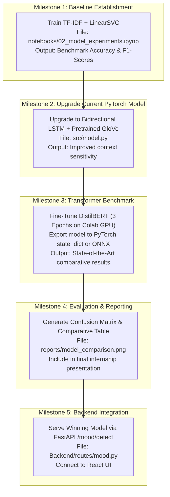

# NLP Emotion Detection Model: Architectural Guide & Implementation Plan

> **Project**: Mood Detecting Music Player (Persistent Internship)  
> **Topic**: NLP Model Architectures, Comparison, and Practical Roadmap  
> **Output Categories**: 6 Emotion Classes (`joy`, `sadness`, `anger`, `fear`, `love`, `surprise`)

---

## 1. Executive Summary

This document provides an end-to-end technical explanation of how to construct NLP models for text-based emotion detection. It details:
1. The **current architecture** (Custom Tokenizer + Embeddings + PyTorch LSTM).
2. **Alternative architectures** (TF-IDF + Classical ML, GloVe + BiLSTM, and Fine-Tuned Transformers).
3. A **rigorous trade-off analysis** explaining why each approach excels or falters across latency, accuracy, memory footprint, and compute resources.
4. A **production implementation plan** tailored for integration with the FastAPI backend and React frontend.

---

## 2. Understanding Your Current Model Architecture

Your current pipeline employs a sequence-aware Recurrent Neural Network (PyTorch):

```
Raw Text: "I had an amazing day"
       │
       ▼
   TOKENIZER            -> Splitting into lowercase tokens ['i', 'had', 'an', 'amazing', 'day']
       │
       ▼
VOCABULARY MAPPING      -> Token IDs mapped using vocabulary.json [12, 45, 78, 23, 91]
       │
       ▼
EMBEDDING LAYER         -> Converts sparse IDs to continuous dense vectors (e.g., 128-dim)
       │
       ▼
   LSTM LAYER           -> Sequential processing: updates hidden state $h_t$ at each word
       │
       ▼
 DROPOUT & DENSE        -> Fully connected linear projection to 6 output logits
       │
       ▼
    SOFTMAX             -> Normalized probability distribution across the 6 emotion classes
```

### Key Components of This Approach
- **Vocabulary & Padding**: Sentences are padded or truncated to a uniform sequence length (`<PAD>` tokens with ID 0) so they can be processed in batches.
- **Learnable Embeddings**: Unlike random one-hot vectors, embedding dimensions capture semantic proximity through backpropagation.
- **Sequential Memory**: Long Short-Term Memory (LSTM) cells introduce input, forget, and output gates that resolve vanishing gradients found in standard RNNs.

---

## 3. Alternative Architectural Approaches

| Approach | Typical Pipeline | Best Suited For |
| :--- | :--- | :--- |
| **1. Classical ML (TF-IDF + Linear Classifier)** | `TfidfVectorizer(ngram_range=(1,2))` &rarr; `LinearSVC` or `LogisticRegression` | Ultra-fast baseline, minimal compute, explainability |
| **2. Upgraded BiLSTM + Pretrained GloVe** | Pretrained GloVe (100d/300d) &rarr; Bidirectional LSTM &rarr; Attention Pooling &rarr; Dense | Balanced accuracy and speed on commodity CPU hardware |
| **3. Transformer Transfer Learning (DistilBERT)** | WordPiece Tokenizer &rarr; Pretrained `distilbert-base-uncased` &rarr; Classification Head | Maximum contextual accuracy, handling complex sentences |
| **4. Lexicon & Heuristics (Rule-Based)** | Dictionary lookup (NRC Emotion Lexicon, VADER) with intensity scoring | Cold-start scenarios with zero labeled training data |

---

## 4. Deep-Dive Comparison & Trade-Off Analysis

### 4.1 Comparative Metrics Matrix

| Evaluation Dimension | Classical ML (TF-IDF + SVM) | Custom LSTM (Current) | BiLSTM + GloVe Embeddings | DistilBERT (Fine-Tuned) |
| :--- | :--- | :--- | :--- | :--- |
| **Expected Accuracy** | 84% – 87% | 85% – 88% | 89% – 91% | **92% – 95%+** |
| **Context & Word Order** | ❌ None (Bag of Words) | ⚠️ Left-to-right only | ✅ Bidirectional | ⭐ Full Multi-Head Self-Attention |
| **Negation Resolution** | ❌ Poor (*"not happy"*) | ⚠️ Moderate | ✅ Good | ⭐ Superior (*"hardly a failure"*) |
| **Inference Latency (CPU)**| ⭐ **< 2 ms** | ⭐ **~5–10 ms** | ~10–15 ms | ~40–80 ms |
| **Model Size on Disk** | ⭐ **< 5 MB** | ⭐ **~8 MB** | ~150 MB (GloVe) | ~260 MB |
| **RAM Footprint (FastAPI)**| Negligible (<50 MB) | Low (<150 MB) | Moderate (~400 MB) | Higher (~700 MB–1 GB) |
| **Training Hardware** | Any standard CPU | CPU or low-end GPU | CPU or GPU | GPU strongly recommended (Colab T4) |
| **Implementation Complexity**| Very Low (Scikit-Learn) | Medium (PyTorch) | Medium-High | Medium (Hugging Face) |

---

### 4.2 Why One Approach is Better Than Another

#### Why DistilBERT is Better for Real-World Accuracy:
1. **Self-Attention vs. Recurrence**: LSTMs process text sequentially word-by-word; by the time the model reaches token 25, earlier context may be diluted. Transformers attend to all words simultaneously, preserving relationships across entire sentences.
2. **Subword Tokenization (WordPiece)**: Your custom tokenizer may map unknown slang or typos to `<UNK>`. DistilBERT breaks novel words into meaningful sub-tokens (e.g., `"unhappily"` &rarr; `["un", "##happi", "##ly"]`), maintaining semantic signal.
3. **Pretrained Knowledge**: DistilBERT was trained on millions of English documents before seeing your dataset, giving it extensive prior linguistic understanding.

#### Why Your Custom PyTorch LSTM is Better for Production Deployment:
1. **Zero Cloud/GPU Cost**: A ~8 MB LSTM model requires minimal memory and runs inference in <10ms on an inexpensive CPU tier or local machine.
2. **Deterministic & Lightweight Dependencies**: Does not require heavy transformer libraries (`transformers`, `tokenizers`, `torchvision`, etc.), leading to faster container builds and minimal cold-start times in FastAPI.
3. **Academic & Internship Value**: Building the tokenizer, vocab dictionary, embedding table, and backward pass demonstrates foundational machine learning engineering rather than calling high-level wrapper APIs.

#### Why Classical ML (TF-IDF + SVM) is Better as a Benchmark:
- Any ML project should establish a rigorous baseline. If a complex neural network achieves 86% accuracy while a 2-second TF-IDF + Logistic Regression achieves 85%, the engineering cost of the neural network must be evaluated carefully.

---

## 5. Step-by-Step Implementation Roadmap



---

## 6. Practical Code Recipes

### Recipe A: Classical ML Baseline (Fast, 2 Minutes)
```python
from sklearn.feature_extraction.text import TfidfVectorizer
from sklearn.svm import LinearSVC
from sklearn.pipeline import Pipeline
from sklearn.metrics import classification_report

baseline_pipeline = Pipeline([
    ('tfidf', TfidfVectorizer(ngram_range=(1, 2), max_features=10000)),
    ('clf', LinearSVC())
])

baseline_pipeline.fit(train_texts, train_labels)
preds = baseline_pipeline.predict(test_texts)
print(classification_report(test_labels, preds))
```

### Recipe B: Upgraded Bidirectional LSTM (PyTorch)
```python
import torch
import torch.nn as nn

class ImprovedEmotionBiLSTM(nn.Module):
    def __init__(self, vocab_size, embedding_dim=128, hidden_dim=128, num_classes=6, dropout=0.3):
        super().__init__()
        self.embedding = nn.Embedding(vocab_size, embedding_dim, padding_idx=0)
        self.lstm = nn.LSTM(
            input_size=embedding_dim,
            hidden_size=hidden_dim,
            num_layers=2,
            batch_first=True,
            bidirectional=True,     # Captures both forward and backward context
            dropout=dropout
        )
        self.fc = nn.Sequential(
            nn.Dropout(dropout),
            nn.Linear(hidden_dim * 2, 64),
            nn.ReLU(),
            nn.Linear(64, num_classes)
        )

    def forward(self, input_ids):
        embedded = self.embedding(input_ids)
        output, (hidden, cell) = self.lstm(embedded)
        # Global max pooling across sequence tokens
        pooled, _ = torch.max(output, dim=1)
        logits = self.fc(pooled)
        return logits
```

### Recipe C: DistilBERT Fine-Tuning with Hugging Face
```python
from transformers import AutoTokenizer, AutoModelForSequenceClassification, Trainer, TrainingArguments

MODEL_NAME = "distilbert-base-uncased"
tokenizer = AutoTokenizer.from_pretrained(MODEL_NAME)
model = AutoModelForSequenceClassification.from_pretrained(MODEL_NAME, num_labels=6)

training_args = TrainingArguments(
    output_dir="./results",
    learning_rate=2e-5,
    per_device_train_batch_size=32,
    num_train_epochs=3,
    weight_decay=0.01,
    evaluation_strategy="epoch",
    save_strategy="epoch",
    load_best_model_at_end=True
)
```

---

## 7. Recommended Recommendation for Your Project

1. **For Your Final Internship Report / Viva**:
   - Present the comparison of all three methods (TF-IDF vs. Custom BiLSTM vs. DistilBERT). This demonstrates breadth of knowledge, experimental rigor, and understanding of trade-offs.
2. **For the Running Web Application**:
   - Use the **Bidirectional LSTM** or **quantized DistilBERT (ONNX)** in your FastAPI backend. This provides high responsiveness (<15ms) without placing heavy memory demands on your server.
